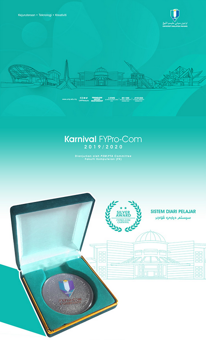

# Student-Diary
<!-- Students Diary --Working Environment Version (Private build) -->
<a name="readme-top"></a>
<!--
*** This was made around alpha and beta version, may break sometimes, required multiples revision
-->


<!-- PROJECT SHIELDS -->

<!-- PROJECT LOGO -->
<br />
<div align="center">
  <a href="https://github.com/shoen1x/Student-Diary">
    
  </a>

<h3 align="center">Student Diary Application</h3>

  <p align="center">
    Student’s Diary Application is a mobile application that allows store their assignment, 
project, information about their studies.
    <br />
    <a href="https://www.instagram.com/nmv_n1x/"><strong>Developer's Social Media »</strong></a>
    <br />
    <br />
    <a href="https://www.behance.net/gallery/141503291/Karnival-FYPro-Com-20192020-UMP">Full visual documentation</a>
  </p>
</div>


<!-- TABLE OF CONTENTS -->
<details>
  <summary>Table of Contents</summary>
  <ol>
    <li>
      <a href="#about-the-project">About The Project</a>
      <ul>
        <li><a href="#built-with">Built With</a></li>
      </ul>
    </li>
    <li>
      <a href="#getting-started">Getting Started</a>
      <ul>
        <li><a href="#prerequisites">Prerequisites</a></li>
        <li><a href="#installation">Installation</a></li>
      </ul>
    </li>
    <li><a href="#usage">Usage</a></li>
    <li><a href="#roadmap">Roadmap</a></li>
    <li><a href="#contributing">Contributing</a></li>
    <li><a href="#license">License</a></li>
    <li><a href="#contact">Contact</a></li>
    <li><a href="#acknowledgments">Acknowledgments</a></li>
  </ol>
</details>


<!-- ABOUT THE PROJECT -->
## About The Project

<div align="center">
    <br />
<a href="https://github.com/shoen1x/Student-Diary">
  
</a>

  <p align="center">
      <br />
    Student’s Diary Application is a mobile application that allows store their assignment, 
project, information about their studies. Not only that, users also can generate their own CV/ 
Portfolio based on their activities and information that have been saved on the application. As 
we know, most students in university are usually busy and have less time to store their works
in single and secure place. This application will be going to help them to save all their works 
easier than manually on book or small notes pad. This Application will sort all the information 
that have been saved based on current semester, user also can edit the and delete info that have 
been saved on the application. It is important for students to have a mobile application system 
that can store their information anytime and anywhere. This system will produce good outcome 
for users as it is efficient and easy to use.
    <br />
  </p>

</div>

<p align="right">(<a href="#readme-top">back to top</a>)</p>


### Built With

* [![React][React.js]][React-url]
* [![Java][Java.js]][java-url]
* [![C++][C++.c]][C++-url]
* [![Bootstrap][Bootstrap.com]][Bootstrap-url]
* [![Firebase][Firebase.fb]][Firebase-url]
* [![JQuery][JQuery.com]][JQuery-url]

<p align="right">(<a href="#readme-top">back to top</a>)</p>


<!-- GETTING STARTED -->
## Getting Started

This program was required consistent internet during start up. Latest android version also required in order to avoid any potential crash and bug.

### Prerequisites

This is an example of how to list things you need to use the software and how to install them. (Dev only)
* npm
  ```sh
  npm install npm@latest -g
  ```

### Installation

Alpha - Dev Version only
1. Get a free API Key at [https://example.com](https://example.com)
2. Clone the repo
   ```sh
   git clone https://github.com/github_username/repo_name.git
   ```
3. Install NPM packages
   ```sh
   npm install
   ```
4. Enter your API in `config.js`
   ```js
   const API_KEY = 'ENTER YOUR API';
   ```

<p align="right">(<a href="#readme-top">back to top</a>)</p>


<!-- USAGE EXAMPLES -->
## Usage

Get started the application with registering and login, after that the user will be forwarded to profile page for finalizing the profile with additional information. After that user can use all features available as note, file, reminder and CV maker.

_For more examples, please refer to the [Documentation](https://github.com/shoen1x/Student-Diary/tree/main/documentation/Documentation.pdf)_

<p align="right">(<a href="#readme-top">back to top</a>)</p>


<!-- ROADMAP -->
## Roadmap

- [x] Basic Features
    - [x] Get Started
    - [x] Login & Register
    - [x] Profile
    - [x] Settings
- [x] Main File Explorer
    - [x] File Manager
        - [x] File display, reminder, create, delete, upload to database
    - [x] Note Manager
        - [x] Note display, reminder, create, delete, upload to database
- [x] Toolbar Features
    - [x] Reminder & Notification
    - [x] Academic Subject
    - [x] Academic Achievement
    - [x] Attendance Record
- [x] Resume Collection & Database Push-out
- [x] Integrated CV Information
    - [x] Collected data from database
        - [x] Real-time PDF Generated CV
    - [ ] TBA
    
See the [open issues](https://github.com/shoen1x/Student-Diary/issues) for a full list of proposed features (and known issues).

<p align="right">(<a href="#readme-top">back to top</a>)</p>


<!-- CONTRIBUTING -->
## Contributing

Contributions are what make the open source community such an amazing place to learn, inspire, and create. Any contributions you make are **greatly appreciated**.

If you have a suggestion that would make this better, please fork the repo and create a pull request. You can also simply open an issue with the tag "enhancement".
Don't forget to give the project a star! Thanks again!

1. Fork the Project
2. Create your Feature Branch (`git checkout -b feature/AmazingFeature`)
3. Commit your Changes (`git commit -m 'Add some AmazingFeature'`)
4. Push to the Branch (`git push origin feature/AmazingFeature`)
5. Open a Pull Request

<p align="right">(<a href="#readme-top">back to top</a>)</p>


<!-- LICENSE -->
## License

Distributed under the MIT License. See `LICENSE.txt` for more information.

<p align="right">(<a href="#readme-top">back to top</a>)</p>


<!-- CONTACT -->
## Contact

Shoenix Studios - [Instagram](https://instagram.com/shoenix_studios) - [Email](mailto:shoenixstudios@gmail.com)

Project Link: [Here](https://github.com/shoen1x/Student-Diary)

<p align="right">(<a href="#readme-top">back to top</a>)</p>


<!-- ACKNOWLEDGMENTS -->
## Acknowledgments

* [UMP Malaysia](https://www.ump.edu.my/en) DR RAHMAH BINTI MOKHTAR

<p align="right">(<a href="#readme-top">back to top</a>)</p>


<!-- MARKDOWN LINKS & IMAGES -->
<!-- https://www.markdownguide.org/basic-syntax/#reference-style-links -->
[contributors-shield]: https://img.shields.io/github/contributors/github_username/repo_name.svg?style=for-the-badge
[contributors-url]: https://github.com/github_username/repo_name/graphs/contributors
[forks-shield]: https://img.shields.io/github/forks/github_username/repo_name.svg?style=for-the-badge
[forks-url]: https://github.com/github_username/repo_name/network/members
[stars-shield]: https://img.shields.io/github/stars/github_username/repo_name.svg?style=for-the-badge
[stars-url]: https://github.com/github_username/repo_name/stargazers
[issues-shield]: https://img.shields.io/github/issues/github_username/repo_name.svg?style=for-the-badge
[issues-url]: https://github.com/github_username/repo_name/issues
[license-shield]: https://img.shields.io/github/license/github_username/repo_name.svg?style=for-the-badge
[license-url]: https://github.com/github_username/repo_name/blob/master/LICENSE.txt
[linkedin-shield]: https://img.shields.io/badge/-LinkedIn-black.svg?style=for-the-badge&logo=linkedin&colorB=555
[linkedin-url]: https://linkedin.com/in/linkedin_username
[C++.c]: https://img.shields.io/badge/c++-20232A?style=for-the-badge&logo=c&logoColor=61DAFB
[C++-url]: https://isocpp.org/
[Firebase.fb]: https://img.shields.io/badge/Firebase-20232A?style=for-the-badge&logo=firebase&logoColor=61DAFB
[Firebase-url]: https://firebase.google.com/
[Java.js]: https://img.shields.io/badge/Java-20232A?style=for-the-badge&logo=javascript&logoColor=61DAFB
[Java-url]: https://www.oracle.com/java/technologies
[React.js]: https://img.shields.io/badge/React-20232A?style=for-the-badge&logo=react&logoColor=61DAFB
[React-url]: https://reactjs.org/
[Bootstrap.com]: https://img.shields.io/badge/Bootstrap-563D7C?style=for-the-badge&logo=bootstrap&logoColor=white
[Bootstrap-url]: https://getbootstrap.com
[JQuery.com]: https://img.shields.io/badge/jQuery-0769AD?style=for-the-badge&logo=jquery&logoColor=white
[JQuery-url]: https://jquery.com
